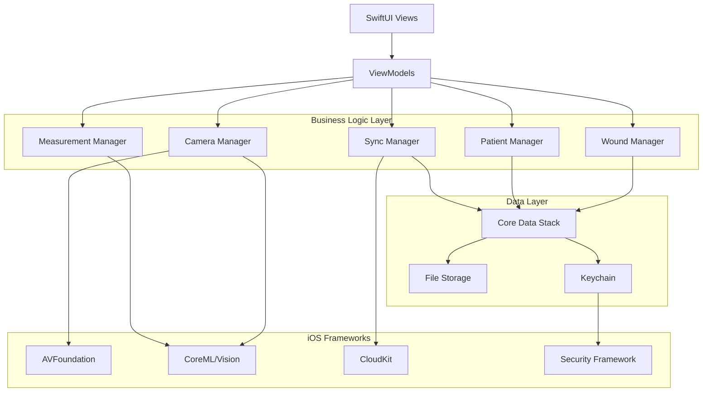
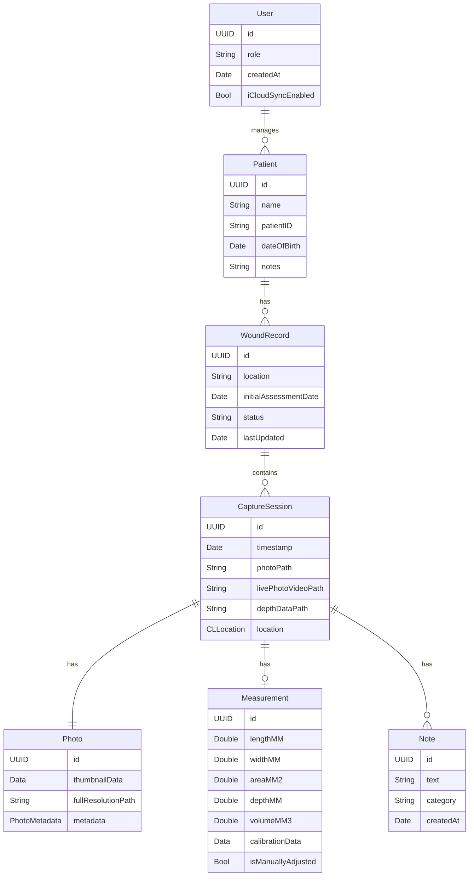

# Design Document: PediLens

## Overview

PediLens is a native iOS application built using SwiftUI that enables doctors and patients to document and track diabetic foot ulcer healing progression. The app leverages advanced iPhone capabilities including camera APIs (AVFoundation), depth sensing (LiDAR/dual-camera), and machine learning (CoreML) for automated wound boundary detection. The architecture follows an offline-first approach with Core Data for local persistence and optional CloudKit synchronization.

### Key Design Principles

1. **Offline-First**: All functionality available without network connectivity
2. **Privacy by Design**: HIPAA-compliant data handling with encryption at rest and in transit
3. **Native iOS**: Leverage platform-specific features for optimal performance and user experience
4. **Clinical Accuracy**: Automated measurements with manual override capabilities
5. **Role-Based UX**: Tailored workflows for doctors vs. patients

## Architecture

### High-Level Architecture



### Architecture Layers

**Presentation Layer (SwiftUI)**
- View components for camera capture, wound timeline, measurements, patient management
- Declarative UI with reactive data binding via Combine
- Platform-native navigation and gestures

**Business Logic Layer**
- Managers encapsulate domain logic and coordinate between data and presentation layers
- Protocol-based design for testability and modularity
- Async/await for asynchronous operations

**Data Layer**
- Core Data for structured data persistence (wound records, measurements, patient info)
- File system for photo/live photo storage with references in Core Data
- Keychain for sensitive credentials and encryption keys
- CloudKit for optional sync (uses NSPersistentCloudKitContainer)

**iOS Frameworks Integration**
- AVFoundation for camera capture and depth data
- Vision + CoreML for wound boundary detection
- Security framework for encryption (AES-256)
- CloudKit for cross-device synchronization

## Components and Interfaces

### 1. Camera Capture System

**CameraManager**
```swift
protocol CameraManagerProtocol {
    func startSession() async throws
    func stopSession()
    func capturePhoto(livePhotoEnabled: Bool) async throws -> CapturedMedia
    func captureDepthData() async throws -> DepthData?
    func setFocusPoint(_ point: CGPoint) async
    func setExposure(_ value: Float) async
}

struct CapturedMedia {
    let photoData: Data
    let livePhotoVideoURL: URL?
    let depthData: DepthData?
    let metadata: PhotoMetadata
}

struct DepthData {
    let depthMap: CVPixelBuffer
    let calibrationData: AVCameraCalibrationData
    let accuracy: DepthAccuracy
}

struct PhotoMetadata {
    let timestamp: Date
    let location: CLLocation?
    let deviceModel: String
    let cameraSettings: CameraSettings
}
```

**Implementation Details**
- Uses AVCaptureSession with AVCapturePhotoOutput for photo capture
- Configures AVCaptureDevice for highest quality (`.photo` preset)
- Enables depth data capture on supported devices (iPhone 12 Pro+, dual-camera devices)
- Supports Live Photo capture via AVCapturePhotoSettings
- Implements AVCapturePhotoCaptureDelegate for async photo delivery
- Handles camera permissions and error states

### 2. Wound Boundary Detection System

**WoundDetectionService**
```swift
protocol WoundDetectionServiceProtocol {
    func detectWoundBoundary(in image: UIImage, 
                            calibration: MeasurementCalibration?) async throws -> WoundBoundary
    func refineDetection(_ boundary: WoundBoundary, 
                        with userAdjustments: [CGPoint]) -> WoundBoundary
}

struct WoundBoundary {
    let points: [CGPoint]  // Boundary polygon points
    let confidence: Float  // Detection confidence 0-1
    let boundingBox: CGRect
    let detectionMethod: DetectionMethod
}

enum DetectionMethod {
    case automatic(modelVersion: String)
    case manual
    case refined(originalConfidence: Float)
}
```

**Implementation Details**
- Uses Vision framework's VNImageRequestHandler for image processing
- CoreML model for semantic segmentation (wound vs. non-wound pixels)
- Post-processing to extract boundary contours from segmentation mask
- Contour simplification using Douglas-Peucker algorithm
- Confidence scoring based on segmentation mask quality
- Manual adjustment support by interpolating user-provided points

**CoreML Model Requirements**
- Input: RGB image (variable size, normalized)
- Output: Segmentation mask (binary or multi-class for wound tissue types)
- Model format: .mlmodel or .mlpackage
- Optimization: Quantized for on-device inference (<50ms latency target)

### 3. Measurement System

**MeasurementManager**
```swift
protocol MeasurementManagerProtocol {
    func calculateMeasurements(boundary: WoundBoundary,
                              calibration: MeasurementCalibration,
                              depthData: DepthData?) -> WoundMeasurement
    func createCalibration(referenceObject: ReferenceObject,
                          pixelDistance: CGFloat) -> MeasurementCalibration
}

struct WoundMeasurement {
    let length: Measurement<UnitLength>
    let width: Measurement<UnitLength>
    let area: Measurement<UnitArea>
    let depth: Measurement<UnitLength>?
    let volume: Measurement<UnitVolume>?
    let perimeter: Measurement<UnitLength>
    let timestamp: Date
    let calibrationUsed: MeasurementCalibration
}

struct MeasurementCalibration {
    let pixelsPerMillimeter: Double
    let referenceObject: ReferenceObject?
    let calibrationDate: Date
    let depthCalibration: DepthCalibration?
}

struct DepthCalibration {
    let depthScale: Float  // Converts depth map values to mm
    let depthOffset: Float
    let confidence: Float
}

enum ReferenceObject {
    case ruler(lengthMM: Double)
    case coin(type: CoinType)
    case custom(name: String, dimensionMM: Double)
}
```

**Measurement Algorithms**

*Area Calculation*
- Shoelace formula for polygon area from boundary points
- Convert pixel area to physical area using calibration
- Formula: `Area = 0.5 * |Σ(x_i * y_(i+1) - x_(i+1) * y_i)| * (pixelsPerMM)^2`

*Length and Width*
- Minimum bounding rectangle around wound boundary
- Length = longer dimension, Width = shorter dimension
- Rotate boundary to find optimal bounding box orientation

*Depth Estimation*
- Extract depth values within wound boundary from depth map
- Calculate average depth relative to surrounding tissue baseline
- Filter outliers using median absolute deviation
- Convert depth map units to millimeters using calibration data

*Volume Calculation*
- Integrate depth values over wound area
- Formula: `Volume = Σ(depth_i * pixel_area) * calibration_factor`
- Assumes wound depth varies continuously across area

### 4. Data Models (Core Data)

**Entity Relationship Diagram**



**Core Data Stack Configuration**
```swift
class PersistenceController {
    static let shared = PersistenceController()
    
    let container: NSPersistentCloudKitContainer
    
    init(inMemory: Bool = false) {
        container = NSPersistentCloudKitContainer(name: "PediLens")
        
        if inMemory {
            container.persistentStoreDescriptions.first?.url = URL(fileURLWithPath: "/dev/null")
        }
        
        // Configure CloudKit sync
        guard let description = container.persistentStoreDescriptions.first else {
            fatalError("Failed to retrieve persistent store description")
        }
        
        // Enable persistent history tracking for sync
        description.setOption(true as NSNumber, 
                            forKey: NSPersistentHistoryTrackingKey)
        description.setOption(true as NSNumber, 
                            forKey: NSPersistentStoreRemoteChangeNotificationPostOptionKey)
        
        // CloudKit container options
        let cloudKitOptions = NSPersistentCloudKitContainerOptions(
            containerIdentifier: "iCloud.com.pedilens.app"
        )
        description.cloudKitContainerOptions = cloudKitOptions
        
        container.loadPersistentStores { description, error in
            if let error = error {
                fatalError("Core Data store failed to load: \(error)")
            }
        }
        
        container.viewContext.automaticallyMergesChangesFromParent = true
        container.viewContext.mergePolicy = NSMergeByPropertyObjectTrumpMergePolicy
    }
}
```

### 5. File Storage System

**FileStorageManager**
```swift
protocol FileStorageManagerProtocol {
    func savePhoto(_ data: Data, for sessionID: UUID) async throws -> URL
    func saveLivePhotoVideo(_ url: URL, for sessionID: UUID) async throws -> URL
    func saveDepthData(_ data: Data, for sessionID: UUID) async throws -> URL
    func loadPhoto(at path: String) async throws -> Data
    func deleteFiles(for sessionID: UUID) async throws
    func getStorageUsage() async -> StorageInfo
}

struct StorageInfo {
    let totalUsedBytes: Int64
    let photoCount: Int
    let availableBytes: Int64
}
```

**Storage Structure**
```
Documents/
  PediLens/
    Photos/
      {sessionID}/
        photo.heic          # Full resolution photo
        thumbnail.jpg       # Thumbnail for list views
        live_video.mov      # Live photo video component
        depth.dat           # Depth map data
    Exports/
      {exportID}/
        report.pdf
        images/
```

**File Management Strategy**
- Store full-resolution photos in HEIC format (efficient compression)
- Generate thumbnails (300x300) for list views
- Encrypt sensitive files using Data Protection API (`.completeFileProtection`)
- Implement storage quota management (warn at 80% capacity)
- Automatic cleanup of orphaned files (no Core Data reference)

### 6. Security and Encryption

**SecurityManager**
```swift
protocol SecurityManagerProtocol {
    func encryptData(_ data: Data) throws -> Data
    func decryptData(_ data: Data) throws -> Data
    func storeEncryptionKey() throws
    func retrieveEncryptionKey() throws -> Data
    func authenticateUser() async throws -> Bool
}
```

**Security Implementation**

*Data at Rest*
- AES-256 encryption for all stored PHI (Protected Health Information)
- Encryption keys stored in iOS Keychain with `.whenUnlockedThisDeviceOnly` accessibility
- File-level encryption using Data Protection API
- Core Data encryption via NSPersistentStore encryption option

*Data in Transit*
- CloudKit uses TLS 1.3 for all network communication
- No third-party servers - only Apple's CloudKit infrastructure
- Certificate pinning for API calls (if custom backend added)

*Authentication*
- Biometric authentication (Face ID/Touch ID) via LocalAuthentication framework
- Fallback to device passcode
- Session timeout after 5 minutes of inactivity
- Re-authentication required for sensitive operations (export, delete)

*HIPAA Compliance Measures*
- Audit logging of all data access (stored locally, encrypted)
- User consent flows for data sharing
- Anonymization options for exports
- Automatic session termination
- Secure deletion (overwrite file data before removal)

### 7. CloudKit Synchronization

**SyncManager**
```swift
protocol SyncManagerProtocol {
    func enableSync() async throws
    func disableSync() async throws
    func forceSyncNow() async throws
    func getSyncStatus() -> SyncStatus
    func resolveConflict(_ conflict: SyncConflict) async throws
}

enum SyncStatus {
    case synced
    case syncing(progress: Double)
    case pending(itemCount: Int)
    case offline
    case error(Error)
}

struct SyncConflict {
    let localVersion: NSManagedObject
    let cloudVersion: CKRecord
    let conflictType: ConflictType
}

enum ConflictType {
    case modifiedBoth
    case deletedLocally
    case deletedRemotely
}
```

**Sync Strategy**
- Uses NSPersistentCloudKitContainer for automatic sync
- Persistent history tracking to detect changes
- Conflict resolution: preserve both versions, user chooses
- Batch uploads for photos (avoid memory pressure)
- Sync queue for offline operations
- Exponential backoff for retry logic

**CloudKit Schema**
- Private database for user's personal data
- Shared database for doctor-patient data sharing (future enhancement)
- Record zones for efficient sync and deletion
- Asset fields for photos (automatic chunking for large files)

### 8. User Role Management

**UserManager**
```swift
protocol UserManagerProtocol {
    func setUserRole(_ role: UserRole) async throws
    func getUserRole() -> UserRole
    func canAccessFeature(_ feature: Feature) -> Bool
}

enum UserRole: String, Codable {
    case doctor
    case patient
}

enum Feature {
    case multiplePatients
    case patientSearch
    case advancedMeasurements
    case dataExport
    case iCloudSync
}
```

**Role-Based Features**

*Doctor Role*
- Patient management (create, edit, search)
- Multiple wound records per patient
- Patient-centric views and filtering
- Bulk export capabilities
- Advanced measurement tools

*Patient Role*
- Single-user wound tracking
- Simplified capture workflow
- Personal timeline view
- Basic export (share with doctor)
- Optional anonymization

### 9. Export System

**ExportManager**
```swift
protocol ExportManagerProtocol {
    func createExport(for records: [WoundRecord], 
                     format: ExportFormat,
                     options: ExportOptions) async throws -> ExportPackage
    func shareExport(_ package: ExportPackage) async throws
}

enum ExportFormat {
    case pdf
    case images
    case native  // PediLens format for import
}

struct ExportOptions {
    let includePhotos: Bool
    let includeMeasurements: Bool
    let includeNotes: Bool
    let anonymize: Bool
    let dateRange: DateInterval?
}

struct ExportPackage {
    let id: UUID
    let format: ExportFormat
    let fileURL: URL
    let metadata: ExportMetadata
}
```

**PDF Report Generation**
- Uses PDFKit for report creation
- Includes wound progression charts
- Measurement tables with trend analysis
- Embedded photos with timestamps
- HIPAA compliance disclaimer
- Optional patient de-identification

## Data Models

### Core Data Entities (Detailed)

**User Entity**
```swift
@objc(User)
public class User: NSManagedObject {
    @NSManaged public var id: UUID
    @NSManaged public var role: String  // "doctor" or "patient"
    @NSManaged public var createdAt: Date
    @NSManaged public var iCloudSyncEnabled: Bool
    @NSManaged public var patients: NSSet?
}
```

**Patient Entity**
```swift
@objc(Patient)
public class Patient: NSManagedObject {
    @NSManaged public var id: UUID
    @NSManaged public var name: String
    @NSManaged public var patientID: String
    @NSManaged public var dateOfBirth: Date?
    @NSManaged public var notes: String?
    @NSManaged public var createdAt: Date
    @NSManaged public var user: User?
    @NSManaged public var woundRecords: NSSet?
}
```

**WoundRecord Entity**
```swift
@objc(WoundRecord)
public class WoundRecord: NSManagedObject {
    @NSManaged public var id: UUID
    @NSManaged public var location: String  // e.g., "Left foot, plantar surface"
    @NSManaged public var initialAssessmentDate: Date
    @NSManaged public var status: String  // "active", "healing", "healed", "archived"
    @NSManaged public var lastUpdated: Date
    @NSManaged public var patient: Patient?
    @NSManaged public var captureSessions: NSSet?
}
```

**CaptureSession Entity**
```swift
@objc(CaptureSession)
public class CaptureSession: NSManagedObject {
    @NSManaged public var id: UUID
    @NSManaged public var timestamp: Date
    @NSManaged public var photoPath: String
    @NSManaged public var livePhotoVideoPath: String?
    @NSManaged public var depthDataPath: String?
    @NSManaged public var latitude: Double
    @NSManaged public var longitude: Double
    @NSManaged public var locationAvailable: Bool
    @NSManaged public var woundRecord: WoundRecord?
    @NSManaged public var measurement: Measurement?
    @NSManaged public var notes: NSSet?
}
```

**Measurement Entity**
```swift
@objc(Measurement)
public class Measurement: NSManagedObject {
    @NSManaged public var id: UUID
    @NSManaged public var lengthMM: Double
    @NSManaged public var widthMM: Double
    @NSManaged public var areaMM2: Double
    @NSManaged public var depthMM: Double  // 0 if not available
    @NSManaged public var volumeMM3: Double  // 0 if not available
    @NSManaged public var perimeterMM: Double
    @NSManaged public var boundaryPoints: Data  // Encoded [CGPoint]
    @NSManaged public var calibrationData: Data  // Encoded MeasurementCalibration
    @NSManaged public var isManuallyAdjusted: Bool
    @NSManaged public var detectionConfidence: Float
    @NSManaged public var captureSession: CaptureSession?
}
```

**Note Entity**
```swift
@objc(Note)
public class Note: NSManagedObject {
    @NSManaged public var id: UUID
    @NSManaged public var text: String
    @NSManaged public var category: String  // "improved", "unchanged", "worsened", "general"
    @NSManaged public var createdAt: Date
    @NSManaged public var captureSession: CaptureSession?
}
```


## Correctness Properties

*A property is a characteristic or behavior that should hold true across all valid executions of a system—essentially, a formal statement about what the system should do. Properties serve as the bridge between human-readable specifications and machine-verifiable correctness guarantees.*

### Property Reflection

After analyzing all acceptance criteria, I identified several areas where properties can be consolidated:

**Consolidation Areas:**
1. **Storage properties** (1.3, 2.8, 4.5, 5.1) can be unified into a general persistence property
2. **Measurement calculation properties** (2.4, 2.5, 2.7) are related but test different aspects - keep separate
3. **Sync properties** (6.1, 6.2) both test sync behavior but in different conditions - keep separate
4. **Timeline display properties** (3.2, 10.3) test similar display requirements - can be consolidated
5. **Authentication properties** (5.4, 9.2) test the same requirement - consolidate
6. **Offline functionality properties** (5.2, 13.1, 13.5) test overlapping offline capabilities - consolidate
7. **Export content properties** (7.1, 7.5) both test export package contents - consolidate
8. **Patient identifier properties** (16.2, 16.3, 16.5, 16.6) test patient metadata in different contexts - consolidate where possible

### Core Properties

**Property 1: Photo Capture Persistence**
*For any* photo captured through the camera interface, the photo data SHALL be immediately stored in local storage and associated with the active wound record.
**Validates: Requirements 1.3, 1.5, 2.8**

**Property 2: Multi-Format Photo Support**
*For any* capture session, both standard photos and live photos SHALL be supported, and when live photos are captured, both still image and video components SHALL be stored.
**Validates: Requirements 1.2, 11.4**

**Property 3: Automatic Wound Boundary Detection**
*For any* valid wound photo, the CoreML-based detection system SHALL produce a wound boundary with a confidence score.
**Validates: Requirements 2.2**

**Property 4: Area Calculation from Boundary**
*For any* established wound boundary, the system SHALL automatically calculate the wound area based on the boundary perimeter points.
**Validates: Requirements 2.4**

**Property 5: Comprehensive Measurement Calculation**
*For any* wound boundary with calibration data, the system SHALL calculate length, width, area, and perimeter measurements.
**Validates: Requirements 2.5**

**Property 6: Depth-Based Volume Calculation**
*For any* wound with both area measurement and depth data available, the system SHALL calculate wound volume.
**Validates: Requirements 2.7**

**Property 7: Depth Estimation on Capable Devices**
*For any* wound photo captured on a device with depth perception capability, the system SHALL estimate wound depth using the depth camera data.
**Validates: Requirements 2.6**

**Property 8: Dual Unit Display**
*For any* measurement displayed to the user, both metric and imperial units SHALL be shown.
**Validates: Requirements 2.9**

**Property 9: Measurement History Preservation**
*For any* measurement modification, the previous measurement version SHALL be preserved in the measurement history.
**Validates: Requirements 2.10**

**Property 10: Timeline Chronological Ordering**
*For any* wound record timeline, all capture sessions SHALL be displayed in reverse chronological order (newest first).
**Validates: Requirements 3.1**

**Property 11: Timeline Entry Completeness**
*For any* timeline entry displayed, it SHALL include thumbnail image, timestamp, and key measurements (area at minimum).
**Validates: Requirements 3.2, 10.3**

**Property 12: Wound Size Change Indicators**
*For any* two timeline entries being compared, visual indicators SHALL show the change in wound size (increased, decreased, or unchanged).
**Validates: Requirements 3.4**

**Property 13: Timeline Date Range Filtering**
*For any* date range filter applied to a timeline, only capture sessions with timestamps within that range SHALL be displayed.
**Validates: Requirements 3.5, 17.6**

**Property 14: Automatic Timestamp Recording**
*For any* capture session created, a timestamp SHALL be automatically recorded at the moment of creation.
**Validates: Requirements 4.2**

**Property 15: Location Recording with Permission**
*For any* capture session created when location permission is granted, device location SHALL be automatically recorded.
**Validates: Requirements 4.3**

**Property 16: Metadata Persistence**
*For any* metadata (notes, tags, timestamps, location) added to a capture session, it SHALL be stored in local storage with the associated wound record.
**Validates: Requirements 4.5, 5.1**

**Property 17: Offline Functionality Completeness**
*For any* core operation (create, read, update wound records and capture sessions) when the device is offline, the operation SHALL complete successfully using local storage.
**Validates: Requirements 5.2, 13.1, 13.5**

**Property 18: Data Encryption at Rest**
*For any* sensitive medical data (PHI) stored in the system, it SHALL be encrypted using AES-256 encryption.
**Validates: Requirements 5.3, 9.1**

**Property 19: Authentication Requirement**
*For any* attempt to access wound records or sensitive data, device authentication (Face ID, Touch ID, or passcode) SHALL be required.
**Validates: Requirements 5.4, 9.2**

**Property 20: iCloud Sync When Enabled**
*For any* wound record when iCloud sync is enabled and network connectivity is available, the record SHALL be synchronized to the user's iCloud account.
**Validates: Requirements 6.1, 6.2**

**Property 21: Sync Conflict Preservation**
*For any* sync conflict detected, both the local and cloud versions SHALL be preserved until user resolution.
**Validates: Requirements 6.3**

**Property 22: Local-Only Operation When Sync Disabled**
*For any* operation when iCloud sync is disabled, the system SHALL function entirely using local storage without attempting cloud operations.
**Validates: Requirements 6.4**

**Property 23: Export Package Creation**
*For any* export request, an export package SHALL be created containing all selected photos, measurements, metadata, and a summary report with wound progression statistics.
**Validates: Requirements 7.1, 7.5**

**Property 24: Multi-Format Export Support**
*For any* export package creation, the system SHALL support generating the requested format (PDF, images, or native format).
**Validates: Requirements 7.2**

**Property 25: Doctor Role Patient Association Requirement**
*For any* wound record created by a doctor user, patient identifiers (name and/or ID) SHALL be required and associated with the record.
**Validates: Requirements 8.4**

**Property 26: Patient Role Self-Documentation**
*For any* wound record created by a patient user, patient identifiers SHALL NOT be required.
**Validates: Requirements 8.5**

**Property 27: Data Anonymization Option**
*For any* export containing patient identifiable information, an anonymization option SHALL be available.
**Validates: Requirements 9.3**

**Property 28: No Third-Party Data Transmission**
*For any* data transmission from the app, it SHALL only be sent to Apple's CloudKit infrastructure (when sync enabled) and SHALL NOT be sent to third-party servers without explicit user consent.
**Validates: Requirements 9.4**

**Property 29: HIPAA Export Warning**
*For any* data export operation, a warning about HIPAA compliance responsibilities SHALL be displayed to the user.
**Validates: Requirements 9.5**

**Property 30: Wound Record Creation Prompts**
*For any* wound record creation, the system SHALL prompt for wound location, initial assessment date, and optional patient information.
**Validates: Requirements 10.2**

**Property 31: Deletion Confirmation**
*For any* wound record deletion request, a confirmation prompt SHALL be displayed before deletion occurs.
**Validates: Requirements 10.5**

**Property 32: Maximum Resolution Capture**
*For any* photo capture, the system SHALL use the highest resolution available on the device's camera.
**Validates: Requirements 11.1**

**Property 33: HDR Photography on Capable Devices**
*For any* photo capture on an HDR-capable device, HDR mode SHALL be enabled.
**Validates: Requirements 11.2**

**Property 34: Calibration Ratio Calculation**
*For any* identified reference object in a photo, a pixel-to-distance calibration ratio SHALL be calculated.
**Validates: Requirements 12.2**

**Property 35: Calibration Application to Measurements**
*For any* measurement taken in a calibrated capture session, the calibration SHALL be applied to the measurement calculations.
**Validates: Requirements 12.3**

**Property 36: Uncalibrated Measurement Warning**
*For any* measurement taken without calibration data, a warning SHALL be displayed indicating measurements are estimates.
**Validates: Requirements 12.5**

**Property 37: Offline Sync Queue**
*For any* sync operation attempted when the device is offline, the operation SHALL be queued for later execution.
**Validates: Requirements 13.2**

**Property 38: Automatic Sync Queue Processing**
*For any* queued sync operation when network connectivity is restored, the operation SHALL be automatically processed.
**Validates: Requirements 13.3**

**Property 39: Sync Status UI Indication**
*For any* sync state (synced, pending, offline, error), the user interface SHALL clearly indicate the current status.
**Validates: Requirements 13.4**

**Property 40: Data Validation Before Persistence**
*For any* wound record data being stored, validation SHALL occur before persisting to ensure data structure integrity.
**Validates: Requirements 14.1**

**Property 41: Data Integrity Checksums**
*For any* photo or metadata file stored, a checksum SHALL be maintained for integrity verification.
**Validates: Requirements 14.3**

**Property 42: Local Error Logging**
*For any* critical error that occurs, an error log entry SHALL be created locally without transmitting data externally.
**Validates: Requirements 14.4**

**Property 43: Doctor Patient Identification Prompt**
*For any* capture session initiated by a doctor user without an associated patient, a prompt for patient identification SHALL appear.
**Validates: Requirements 16.1**

**Property 44: Patient Metadata in Doctor Captures**
*For any* capture session by a doctor user, patient name and ID SHALL be displayed in the camera interface and embedded in the captured image metadata.
**Validates: Requirements 16.2, 16.3, 16.5, 16.6**

**Property 45: Patient Record Display with Statistics**
*For any* patient selected by a doctor user, all associated wound records SHALL be displayed along with summary statistics (total wounds, active wounds, healing trends).
**Validates: Requirements 17.2, 17.5**

**Property 46: Patient Search Partial Matching**
*For any* search query in the patient search functionality, results SHALL include all patients with names or IDs that partially match the query.
**Validates: Requirements 17.4**

**Property 47: Multi-Criteria Record Filtering**
*For any* filter applied (date range, wound status, or wound location), only records matching ALL active filter criteria SHALL be displayed.
**Validates: Requirements 17.6**


## Error Handling

### Error Categories

**1. Camera Errors**
- Camera permission denied → Show permission request dialog with explanation
- Camera hardware unavailable → Display error message, disable capture features
- Photo capture failed → Retry mechanism (up to 3 attempts), then show error
- Depth data unavailable → Gracefully degrade to 2D measurements only
- Low storage space → Warn user before capture, suggest cleanup

**2. Detection Errors**
- CoreML model loading failed → Fall back to manual boundary marking
- Wound detection confidence too low (<0.3) → Prompt user for manual adjustment
- Detection timeout (>5 seconds) → Cancel and allow manual marking
- Invalid image format → Show error, request recapture

**3. Storage Errors**
- Disk full → Prevent new captures, show storage management UI
- File write failed → Retry with exponential backoff, queue for later
- Core Data save failed → Rollback transaction, show error, preserve user input
- Encryption key unavailable → Request authentication, regenerate if needed
- File corruption detected → Attempt recovery from iCloud, mark as corrupted

**4. Sync Errors**
- Network unavailable → Queue operations, show offline indicator
- iCloud quota exceeded → Notify user, disable sync until resolved
- Authentication failed → Re-authenticate user with iCloud
- Sync conflict → Present both versions to user for resolution
- CloudKit rate limit → Implement exponential backoff, queue operations

**5. Measurement Errors**
- No calibration available → Show warning, provide estimated measurements
- Invalid boundary (self-intersecting) → Reject and request correction
- Depth data quality insufficient → Disable depth/volume measurements
- Calculation overflow → Cap at maximum reasonable value, log error

**6. Export Errors**
- PDF generation failed → Retry, fall back to image-only export
- Export file too large → Compress images, offer to split export
- Share sheet unavailable → Show error, save export to Files app
- Insufficient permissions → Request permissions, explain requirement

### Error Recovery Strategies

**Automatic Recovery**
- Retry transient failures (network, file I/O) with exponential backoff
- Queue operations for later when offline
- Graceful degradation (e.g., 2D measurements when depth unavailable)
- Automatic sync conflict detection and preservation

**User-Assisted Recovery**
- Clear error messages with actionable steps
- Manual boundary adjustment when detection fails
- Conflict resolution UI for sync conflicts
- Storage management tools for disk space issues

**Data Protection**
- Transaction rollback on Core Data failures
- Preserve user input on errors (don't lose capture session data)
- Maintain data integrity checksums
- Automatic backups via iCloud (when enabled)

### Logging Strategy

**Local Logging**
- All errors logged locally with timestamp, context, and stack trace
- Logs encrypted and stored in app's Documents directory
- Log rotation (keep last 7 days, max 10MB)
- No automatic transmission of logs (privacy)

**User-Accessible Logs**
- Settings screen option to view/export logs for support
- Logs sanitized to remove PHI before export
- Include device info, OS version, app version in logs

## Testing Strategy

### Dual Testing Approach

PediLens requires both unit testing and property-based testing for comprehensive coverage:

**Unit Tests** focus on:
- Specific examples of wound measurements with known inputs/outputs
- Edge cases (empty boundaries, single-point boundaries, very large wounds)
- Error conditions (invalid calibration, missing depth data)
- Integration points (Core Data saves, file system operations)
- UI component rendering and interaction

**Property-Based Tests** focus on:
- Universal properties that hold for all inputs (see Correctness Properties section)
- Comprehensive input coverage through randomization
- Invariants that must be maintained (data integrity, measurement consistency)
- Round-trip properties (save/load, export/import, sync up/down)

### Property-Based Testing Configuration

**Framework**: Use [swift-check](https://github.com/typelift/SwiftCheck) for property-based testing in Swift

**Test Configuration**:
- Minimum 100 iterations per property test (due to randomization)
- Each property test references its design document property
- Tag format: `// Feature: pedilens, Property {number}: {property_text}`

**Example Property Test Structure**:
```swift
import XCTest
import SwiftCheck
@testable import PediLens

class MeasurementPropertiesTests: XCTestCase {
    // Feature: pedilens, Property 4: Area Calculation from Boundary
    func testAreaCalculationFromBoundary() {
        property("For any wound boundary, area is automatically calculated") <- forAll { (points: [CGPoint]) in
            guard points.count >= 3 else { return Discard() }
            
            let boundary = WoundBoundary(points: points, 
                                        confidence: 0.8,
                                        boundingBox: .zero,
                                        detectionMethod: .automatic(modelVersion: "1.0"))
            let calibration = MeasurementCalibration(pixelsPerMillimeter: 1.0,
                                                     referenceObject: nil,
                                                     calibrationDate: Date(),
                                                     depthCalibration: nil)
            
            let measurement = MeasurementManager().calculateMeasurements(
                boundary: boundary,
                calibration: calibration,
                depthData: nil
            )
            
            return measurement.area.value > 0
        }.withSize(100)
    }
}
```

### Test Coverage Goals

**Unit Test Coverage**:
- Business logic layer: >90%
- Data layer: >85%
- UI ViewModels: >80%
- UI Views: >60% (focus on logic, not SwiftUI rendering)

**Property Test Coverage**:
- All 47 correctness properties implemented as property-based tests
- Each property test runs minimum 100 iterations
- Focus on data integrity, measurement accuracy, and sync correctness

### Testing Environments

**Local Testing**:
- Xcode unit test target
- iOS Simulator for UI tests
- Physical device testing for camera and depth features

**CI/CD Testing**:
- GitHub Actions or Xcode Cloud
- Automated test runs on PR and merge
- Test on multiple iOS versions (iOS 16+)
- Test on multiple device types (iPhone 12 Pro+, devices with/without LiDAR)

### Manual Testing Checklist

**Camera Features**:
- [ ] Photo capture on devices with/without LiDAR
- [ ] Live photo capture and playback
- [ ] HDR and Night Mode activation
- [ ] Manual focus, exposure, white balance controls
- [ ] Low light performance

**Wound Detection**:
- [ ] Automatic boundary detection accuracy
- [ ] Manual boundary adjustment
- [ ] Detection confidence scoring
- [ ] Various wound types and sizes

**Measurements**:
- [ ] Calibration with ruler, coin, custom objects
- [ ] Area, length, width calculations
- [ ] Depth estimation on LiDAR devices
- [ ] Volume calculation
- [ ] Unit conversion accuracy

**Data Persistence**:
- [ ] Offline create, read, update, delete
- [ ] App backgrounding and foregrounding
- [ ] Device restart data persistence
- [ ] Storage quota management

**iCloud Sync**:
- [ ] Initial sync setup
- [ ] Automatic sync on changes
- [ ] Conflict resolution
- [ ] Sync across multiple devices
- [ ] Offline queue and sync on reconnect

**Export**:
- [ ] PDF report generation
- [ ] Image export with metadata
- [ ] Native format export/import
- [ ] Share sheet integration
- [ ] Anonymization

**Security**:
- [ ] Biometric authentication
- [ ] Data encryption verification
- [ ] Session timeout
- [ ] Secure deletion

**Accessibility**:
- [ ] VoiceOver navigation
- [ ] Dynamic Type support
- [ ] Voice Control
- [ ] Color contrast

## Implementation Notes

### Technology Stack

**Language**: Swift 5.9+
**UI Framework**: SwiftUI
**Minimum iOS Version**: iOS 16.0 (for LiDAR and latest camera APIs)
**Persistence**: Core Data with CloudKit
**ML Framework**: CoreML + Vision
**Camera**: AVFoundation
**Security**: Security framework, LocalAuthentication

### Third-Party Dependencies

**Recommended**:
- SwiftCheck (property-based testing)
- None for production code (use native iOS frameworks)

**Avoid**:
- Third-party analytics (privacy concerns)
- Third-party crash reporting (PHI concerns)
- Third-party cloud storage (HIPAA compliance)

### Development Phases

**Phase 1: Core Infrastructure** (Weeks 1-2)
- Project setup, Core Data model
- File storage system
- Security and encryption
- Basic UI navigation

**Phase 2: Camera and Capture** (Weeks 3-4)
- Camera integration
- Photo and live photo capture
- Depth data capture
- Basic wound record creation

**Phase 3: Detection and Measurement** (Weeks 5-6)
- CoreML model integration
- Wound boundary detection
- Measurement calculations
- Calibration system

**Phase 4: Timeline and History** (Week 7)
- Timeline UI
- Comparison views
- Filtering and sorting

**Phase 5: User Roles and Patients** (Week 8)
- Role selection
- Patient management
- Doctor workflows

**Phase 6: Sync and Export** (Weeks 9-10)
- CloudKit integration
- Sync conflict resolution
- Export system (PDF, images)

**Phase 7: Polish and Testing** (Weeks 11-12)
- Accessibility
- Error handling refinement
- Performance optimization
- Comprehensive testing

### Performance Considerations

**Image Processing**:
- Resize images for ML inference (max 1024x1024)
- Use background queues for CoreML inference
- Cache detection results
- Lazy load full-resolution images

**Storage**:
- Use HEIC format for photos (50% smaller than JPEG)
- Generate thumbnails asynchronously
- Implement pagination for timeline (load 20 at a time)
- Monitor storage usage, warn at 80% capacity

**Sync**:
- Batch sync operations
- Use background URLSession for uploads
- Implement rate limiting
- Compress data before upload

**UI**:
- Use LazyVStack/LazyHStack for lists
- Implement view recycling
- Minimize state updates
- Profile with Instruments

### Privacy and Compliance

**HIPAA Considerations**:
- This app is designed to support HIPAA compliance but requires organizational BAA
- Developers/organizations must sign Business Associate Agreement with Apple for CloudKit
- Implement audit logging
- Provide data breach notification procedures
- Regular security assessments

**App Store Requirements**:
- Privacy nutrition label (data collection disclosure)
- Medical device disclaimer (not FDA approved for diagnosis)
- Terms of service and privacy policy
- Age rating: 17+ (medical content)

**Data Retention**:
- User controls data retention
- Provide data export before account deletion
- Secure deletion procedures
- No automatic data deletion

